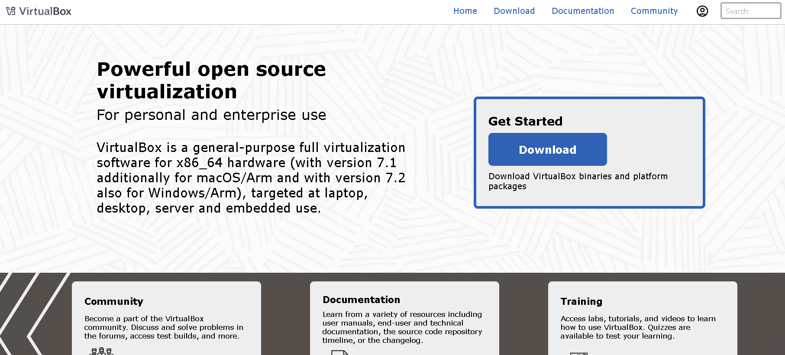
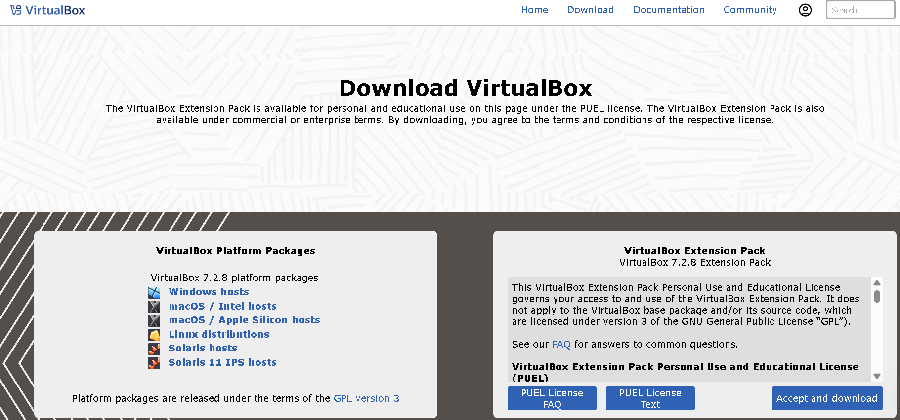
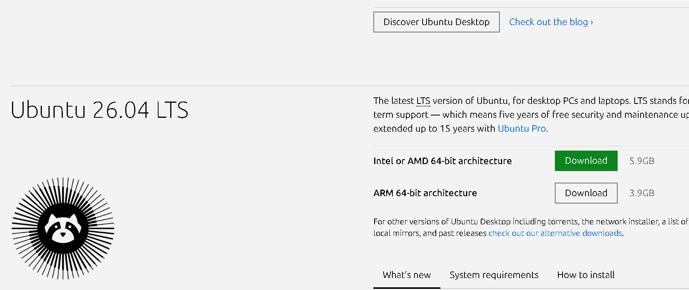

# Lab 1 : Téléchargements de VirtualBox et d'Ubuntu Linux

Ce lab vous guidera à travers les étapes nécessaires pour préparer votre environnement en téléchargeant l'hyperviseur **VirtualBox** et l'image ISO d'**Ubuntu**.

## Étape 1 : Accéder au site officiel de VirtualBox
1. Ouvrez votre navigateur et recherchez **VirtualBox** ou allez directement sur le site : [https://www.virtualbox.org/](https://www.virtualbox.org/).
2. C'est le premier lien qui apparaît dans les résultats de recherche.

## Étape 2 : Téléchargement de VirtualBox
1. Sur la page d'accueil, cliquez sur le gros bouton **Download VirtualBox**.

2. Vous serez redirigé vers la page des téléchargements.
3. Choisissez la version pour votre système d'exploitation. Si vous êtes sur Windows, cliquez sur **Windows hosts**.

4. Le téléchargement de l'exécutable (.exe) commencera automatiquement.

## Étape 3 : Téléchargement de l'image ISO d'Ubuntu
1. Allez sur le site officiel d'Ubuntu : [https://ubuntu.com/download/desktop](https://ubuntu.com/download/desktop).
2. Cliquez sur le bouton **Download 24.04 LTS** (ou la version recommandée).

3. Le fichier ISO commencera à se télécharger. Ce fichier pèse environ 4.7 Go, assurez-vous d'avoir une bonne connexion.

---
**Note :** Une fois ces deux fichiers téléchargés, vous serez prêt pour l'étape suivante : la configuration de la machine virtuelle.
