# Lab : Téléchargements de VMware Workstation Pro et d'Ubuntu Linux

Ce lab vous guidera à travers toutes les étapes nécessaires pour préparer votre environnement en téléchargeant l'hyperviseur VMware Workstation Pro et l'image ISO d'Ubuntu.

## Étape 1 : Création d'une adresse e-mail Proton Mail
1. Allez sur le site de Proton Mail : [https://mail.proton.me/u/0/inbox](https://mail.proton.me/u/0/inbox) et créez un compte.
2. Gardez votre boîte de réception ouverte, vous en aurez besoin pour recevoir le code de vérification de Broadcom.

## Étape 2 : Inscription sur le portail Broadcom
1. Ouvrez un nouvel onglet et tapez **Broadcom registration** dans votre navigateur, ou allez directement sur : [https://profile.broadcom.com/web/registration](https://profile.broadcom.com/web/registration).
2. Saisissez l'adresse e-mail Proton Mail que vous venez de créer et remplissez le Captcha, puis cliquez sur **Next**.

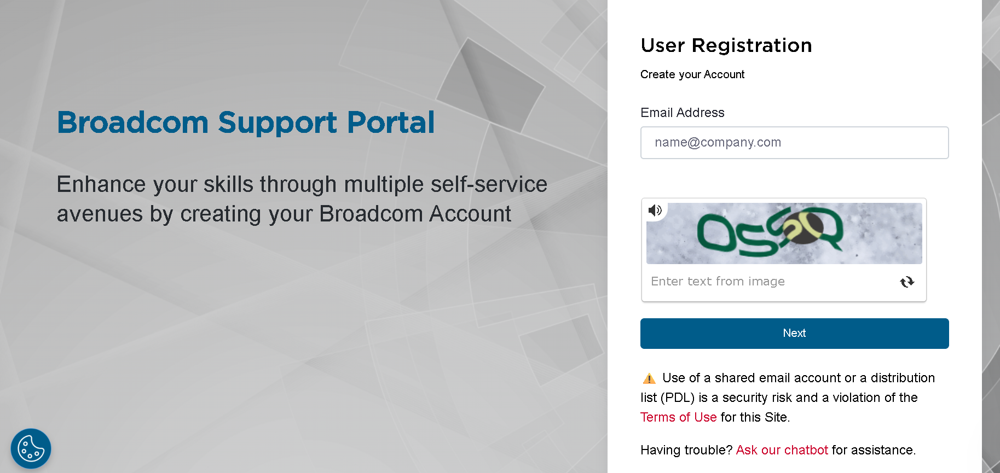

## Étape 3 : Vérification de l'e-mail
1. Un code de vérification vous sera envoyé. Retournez sur votre boîte de réception Proton Mail pour le récupérer.

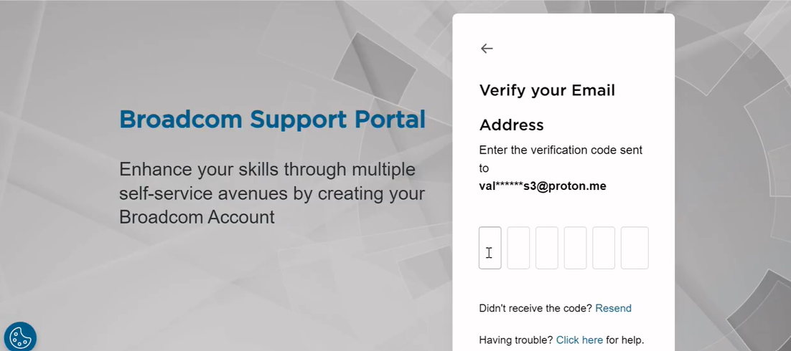

2. Tapez le code sur le site de Broadcom et cliquez sur **Verify & Continue**.

## Étape 4 : Finalisation de la création du compte
1. Remplissez le formulaire avec vos informations (Prénom, Nom, Pays, Titre du poste, Mot de passe).

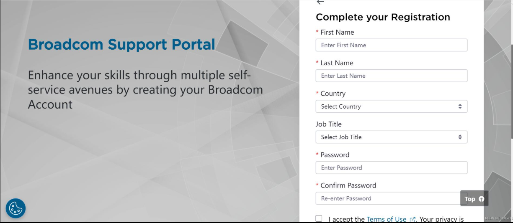

2. Cliquez sur **Create Account**.
3. Un message de succès "Registered Successfully!" apparaîtra.

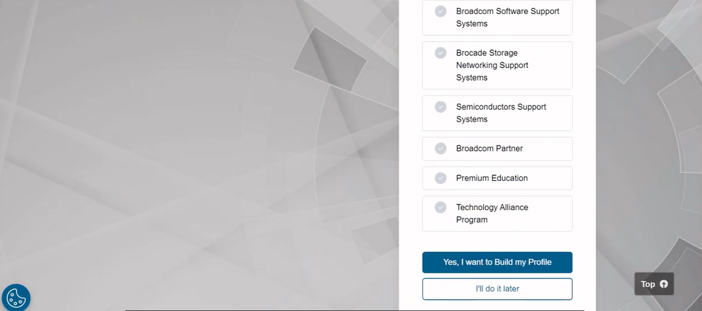

4. Cliquez sur **"I'll do it later"** pour finaliser l'inscription. Votre compte est maintenant créé.

## Étape 5 : Téléchargement de VMware Workstation Pro
1. Sur votre navigateur, cherchez **"vmware workstation download"** et cliquez sur le premier lien : [https://www.vmware.com/products/desktop-hypervisor/workstation-and-fusion](https://www.vmware.com/products/desktop-hypervisor/workstation-and-fusion).
2. Cliquez sur le bouton **DOWNLOAD NOW**.

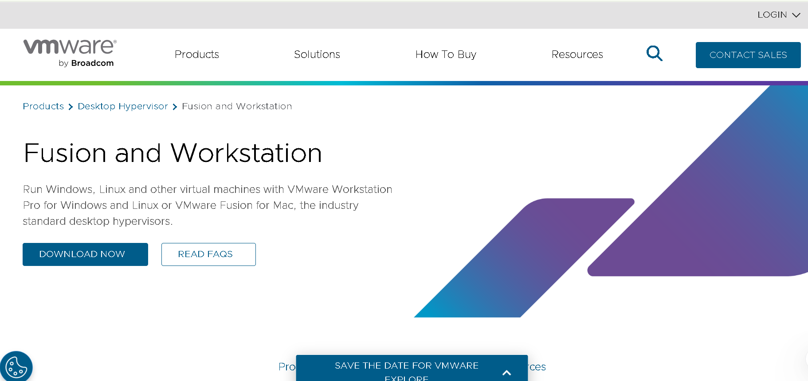

3. Vous serez redirigé vers le site de téléchargement de Broadcom : [https://support.broadcom.com/group/ecx/downloads](https://support.broadcom.com/group/ecx/downloads).
4. Cliquez sur **HERE**.

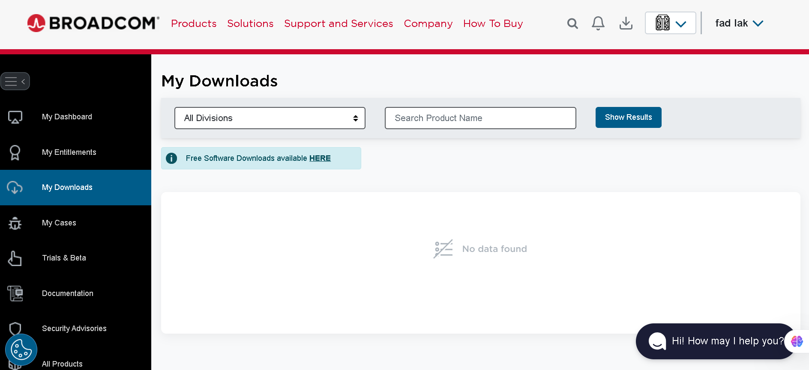

5. Dans la barre de recherche, tapez **vmware workstation** et choisissez **VMware Workstation Pro**.

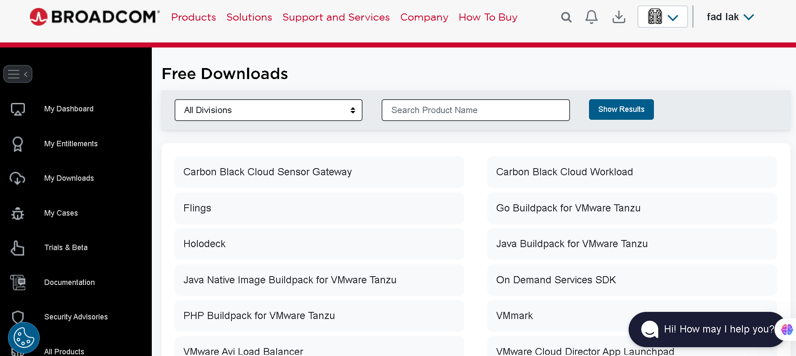

6. Sélectionnez la version spécifique : **VMware Workstation Pro 17.0 for Windows** et choisissez la version **17.6.4**.

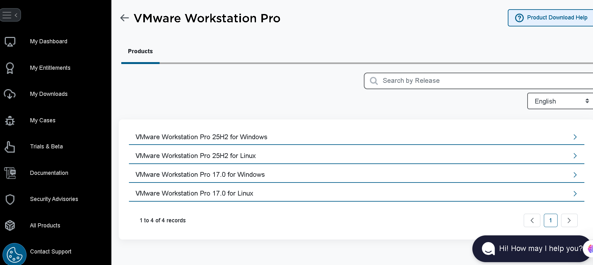

7. Cliquez sur les termes et conditions, puis cochez **"I agree to"**.

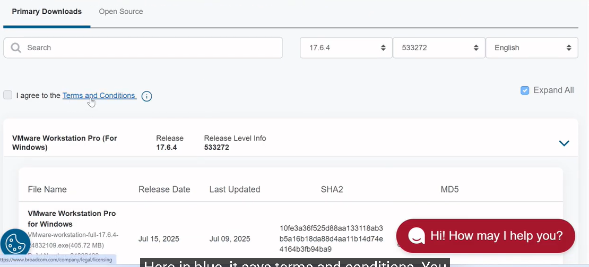

8. Cliquez sur l'icône de **Téléchargement**.

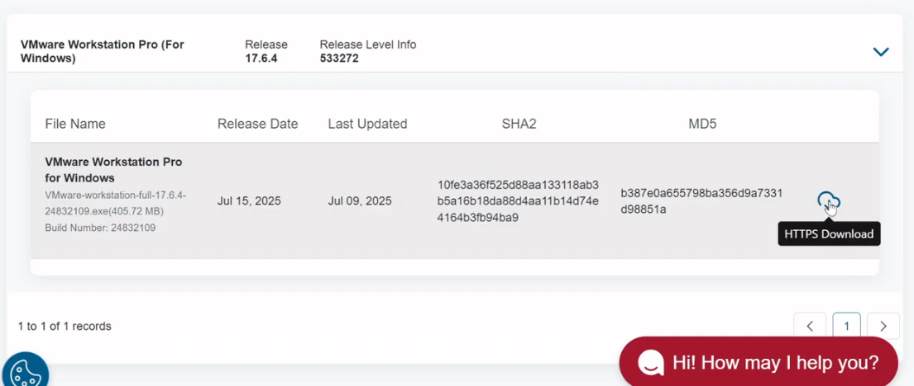

9. Une fenêtre de vérification apparaîtra. Cochez **"Yes"**.

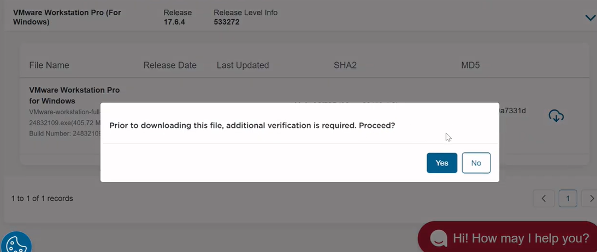

10. Remplissez le formulaire avec vos informations, cochez à nouveau **"I agree"** et cliquez sur **Submit**.

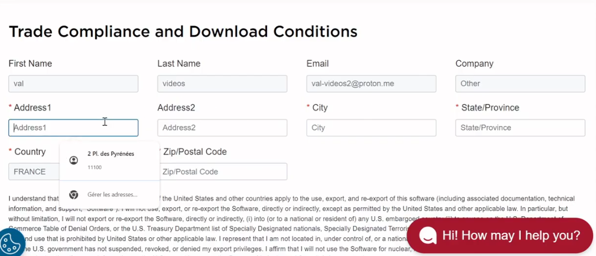

11. Retournez sur la même interface de téléchargement et cliquez une dernière fois sur l'icône de **Téléchargement**. Le fichier va maintenant se télécharger !

## Étape 6 : Téléchargement de l'image ISO d'Ubuntu
1. Allez sur le site officiel de la communauté francophone d'Ubuntu : [https://www.ubuntu-fr.org/download/](https://www.ubuntu-fr.org/download/).
2. Cliquez sur le bouton **Télécharger** pour obtenir le fichier ISO de la version souhaitée.

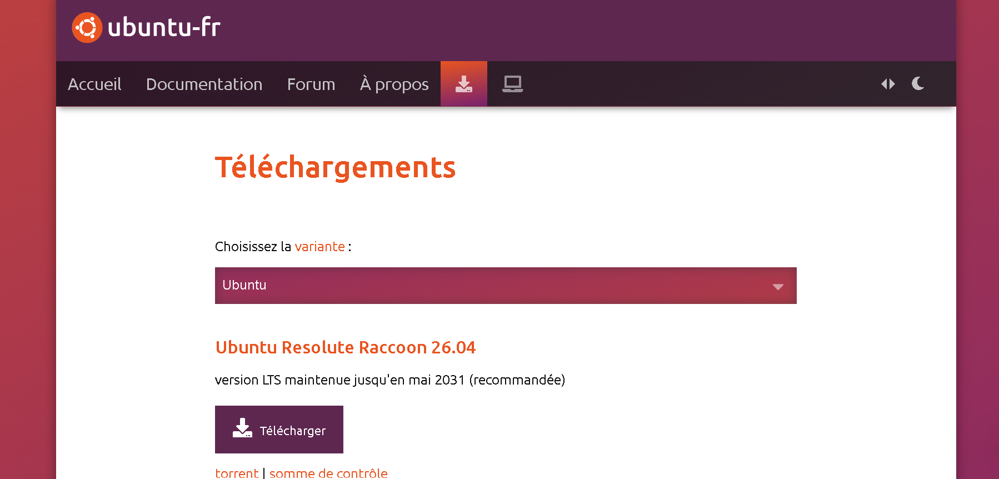
