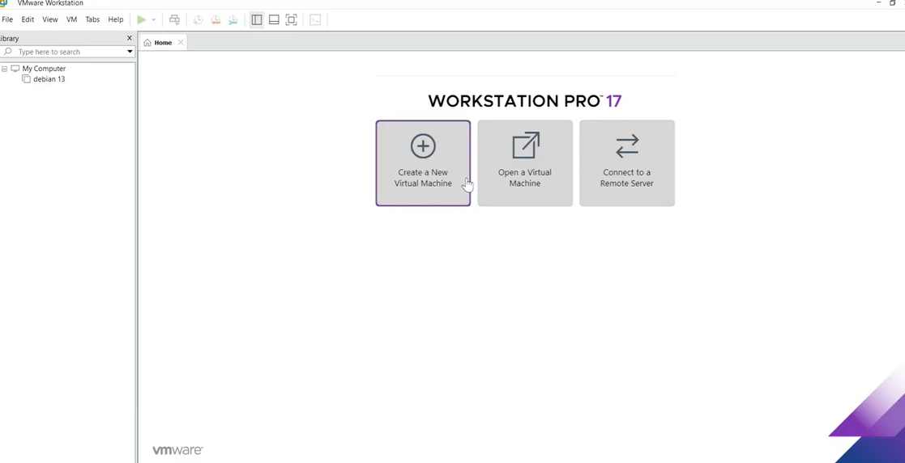
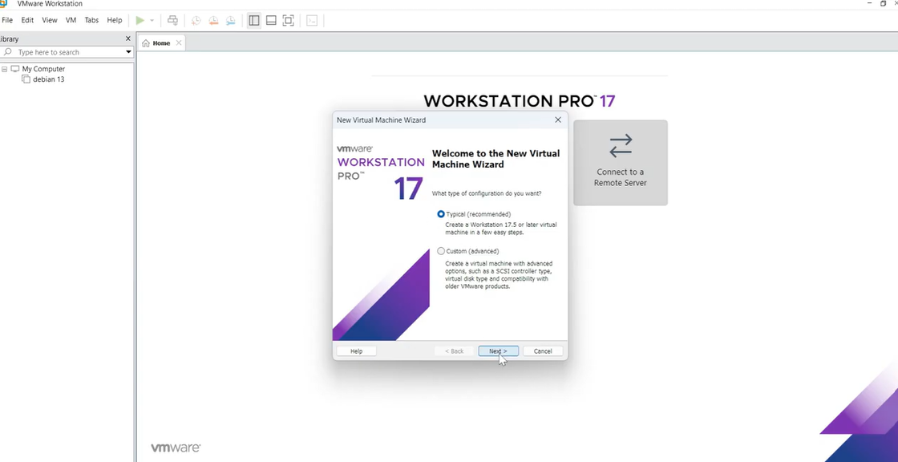
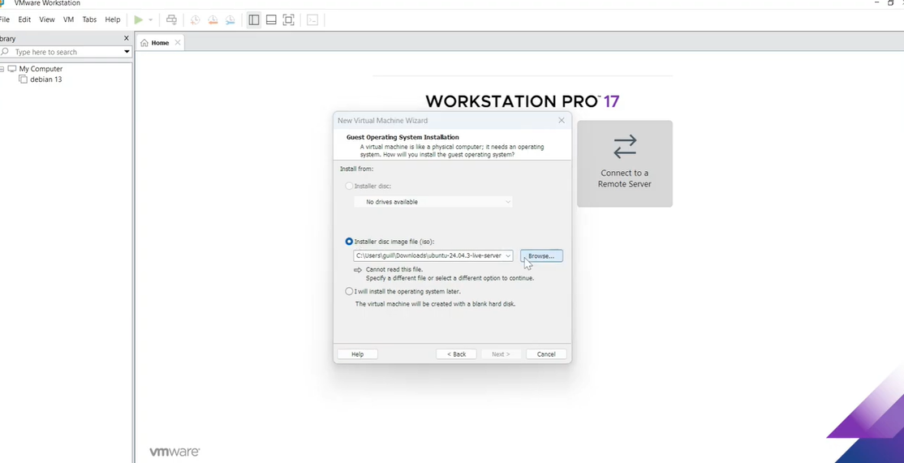
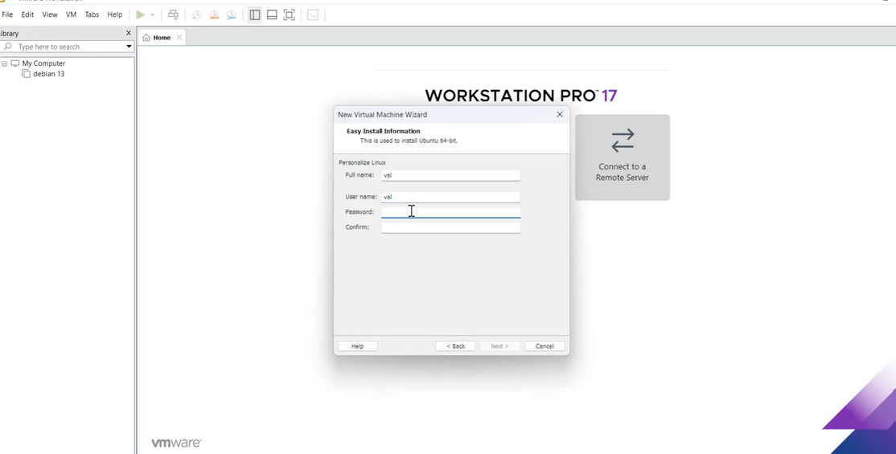
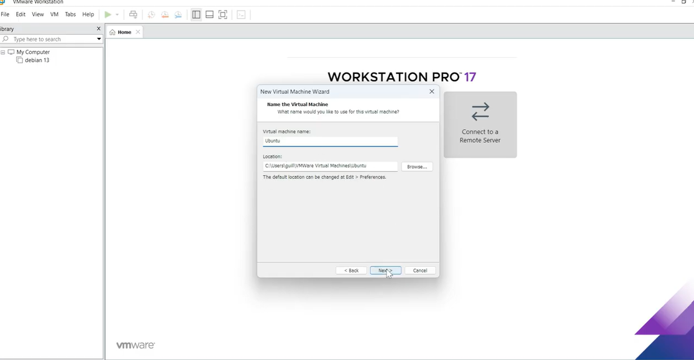
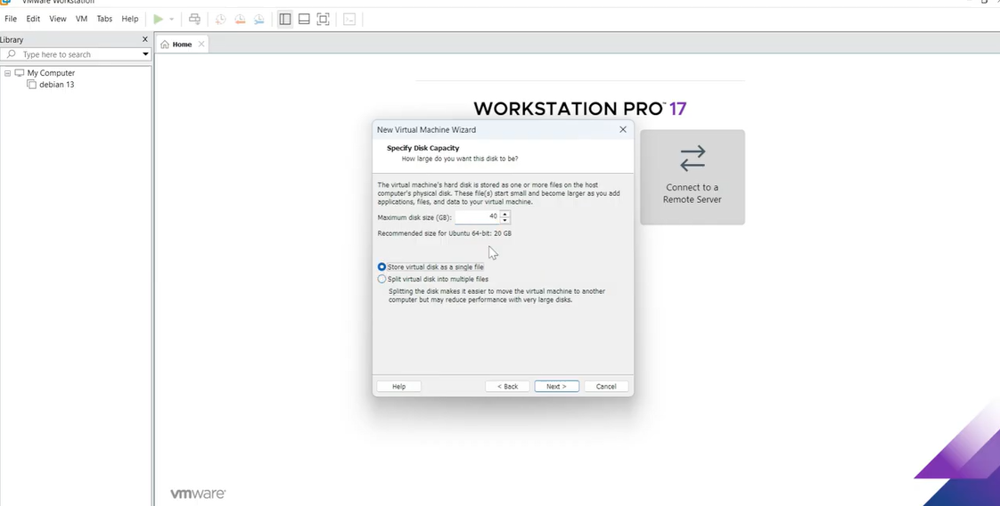
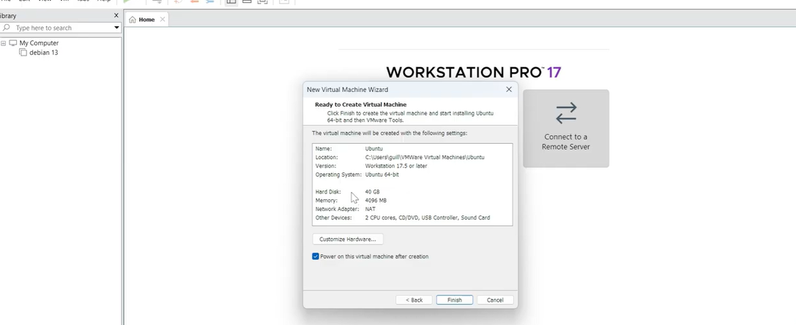
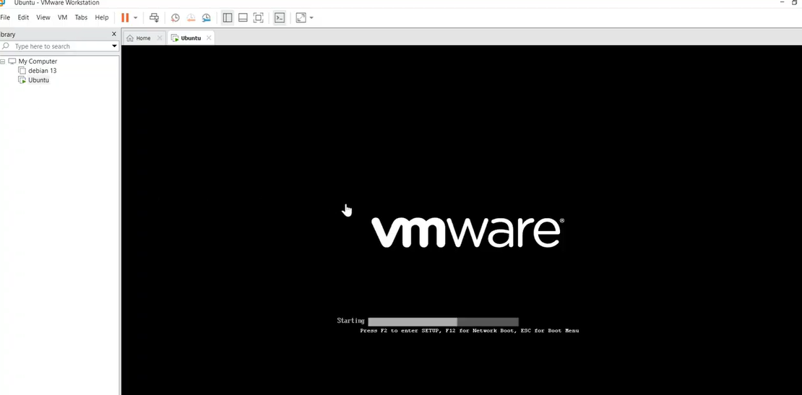

# Lab : Création et Installation de la Machine Virtuelle Ubuntu

Ce lab vous guidera à travers les étapes de création de votre machine virtuelle sur VMware Workstation Pro et l'installation du système d'exploitation Ubuntu.

## Étape 1 : Création de la machine virtuelle sur VMware
1. Ouvrez **VMware Workstation Pro**.
2. Sur l'écran d'accueil, cliquez sur **Create a New Virtual Machine** (Créer une nouvelle machine virtuelle).

3. Dans l'assistant de configuration, choisissez l'option **Typical (recommended)** (Typique) et cliquez sur **Next**.

4. Sélectionnez l'option **Installer disc image file (iso)**.
5. Cliquez sur **Browse** (Parcourir) et sélectionnez le fichier ISO d'Ubuntu que vous avez téléchargé lors du lab précédent. Cliquez ensuite sur **Next**.

6. Dans la fenêtre "Easy Install Information", saisissez vos informations de connexion pour Ubuntu : **Full name** (Nom complet), **User name** (Nom d'utilisateur) et **Password** (Mot de passe).

7. Cliquez sur **Next** pour poursuivre l'installation de la machine virtuelle.
8. Dans la fenêtre "Name the Virtual Machine", tapez le nom de votre machine virtuelle et choisissez son emplacement (Location). Cliquez sur **Next**.

9. Dans "Specify Disk Capacity", choisissez la taille du disque dur (ex: **40 GB**) et cochez l'option **Store virtual disk as a single file**. Cliquez sur **Next**.

10. Un résumé de la configuration apparaît dans "Ready to Create Virtual Machine". Vérifiez les paramètres et cliquez sur **Finish**.

11. La machine virtuelle est maintenant créée et elle démarre automatiquement. L'écran de démarrage de VMware s'affichera.

