# Lab : Installation du Système d'Exploitation Ubuntu Linux

Ce lab fait suite à la configuration de la machine virtuelle sur VMware et vous guidera tout au long du processus d'installation d'Ubuntu.

## Étape 1 : Démarrage de l'installation
1. Une fois la machine virtuelle démarrée, le système se charge et l'écran affiche la version d'Ubuntu (ex: Ubuntu 24.04). L'installation va se poursuivre automatiquement.

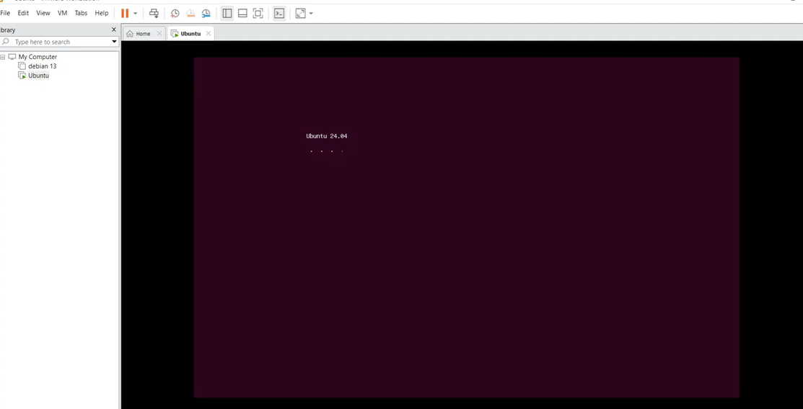

2. Un écran de chargement avec la mention "Preparing Ubuntu..." va s'afficher. Patientez quelques instants.

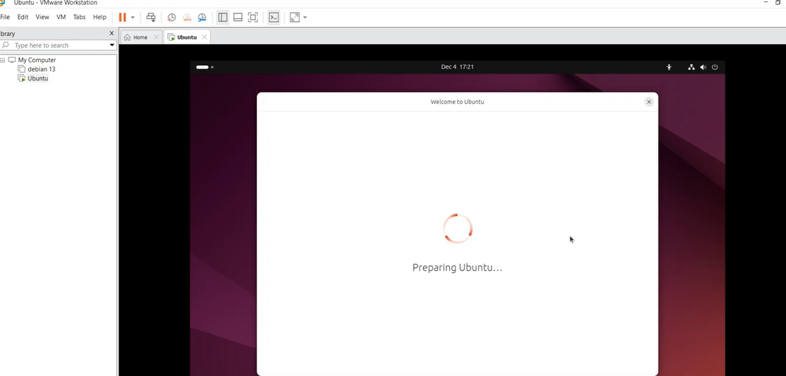

3. Sur l'écran de bienvenue, choisissez votre langue (ex: Français) dans la liste et cliquez sur **Suivant**.

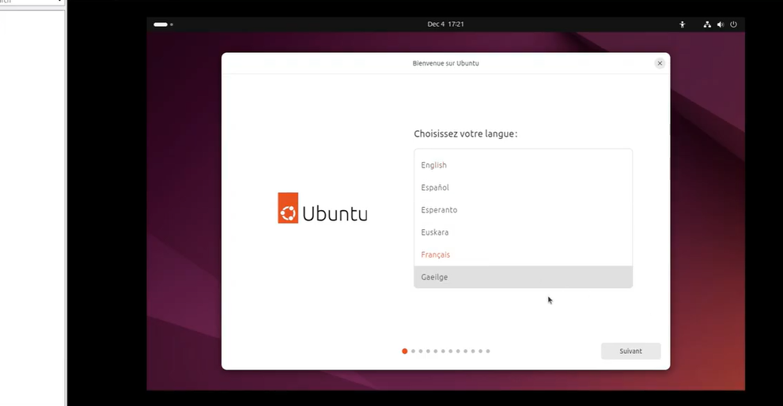

4. L'écran d'Accessibilité va s'afficher. Cliquez simplement sur **Suivant** pour passer cette étape.

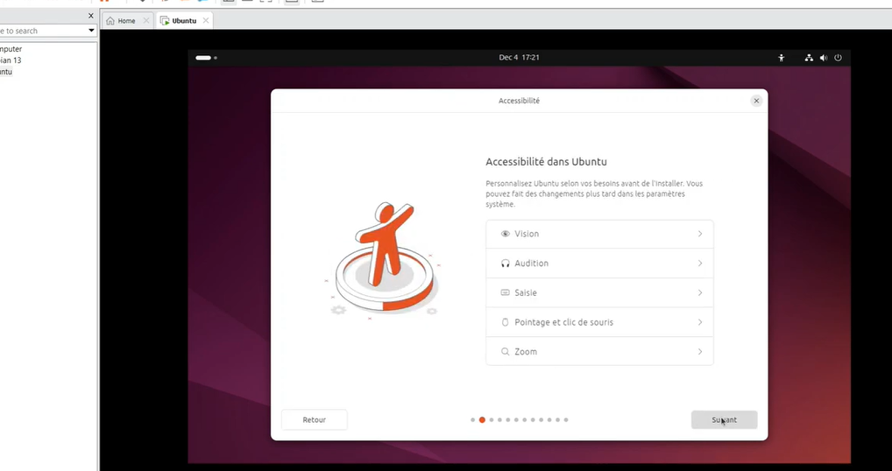

5. Sur l'écran "Disposition du clavier", sélectionnez la langue de votre clavier (ex: Français) et cliquez sur **Suivant**.

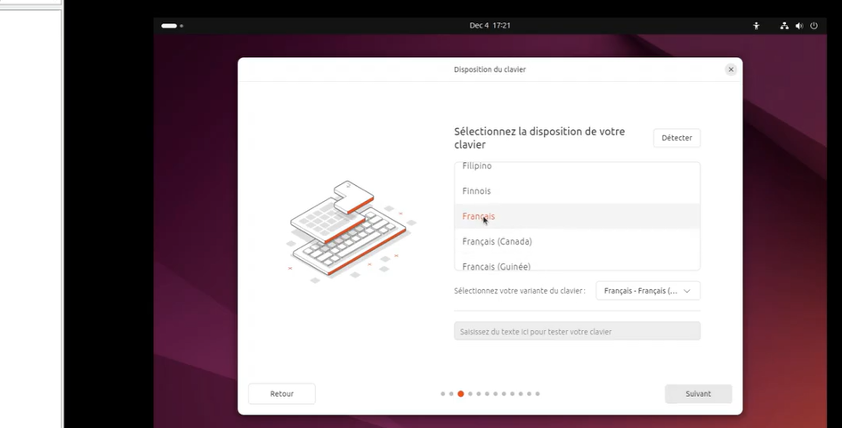

6. Sur l'écran "Connexion Internet", cochez l'option **"Je ne souhaite pas me connecter à internet pour l'instant"** puis cliquez sur **Suivant** (ou Submit).

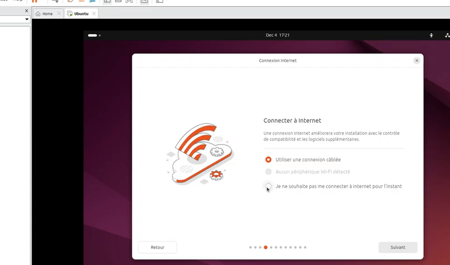

7. Sur l'écran "Mise à jour disponible", cliquez sur **Ignorer** pour passer cette étape sans faire de mise à jour immédiate.

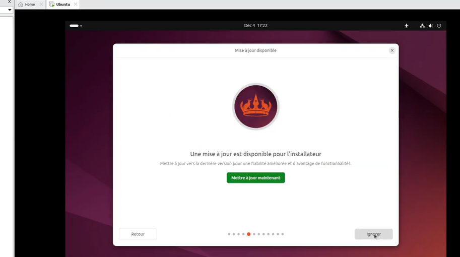

8. Sur l'écran "Essayer ou installer Ubuntu", choisissez l'option **Installer Ubuntu** et cliquez sur **Suivant**.

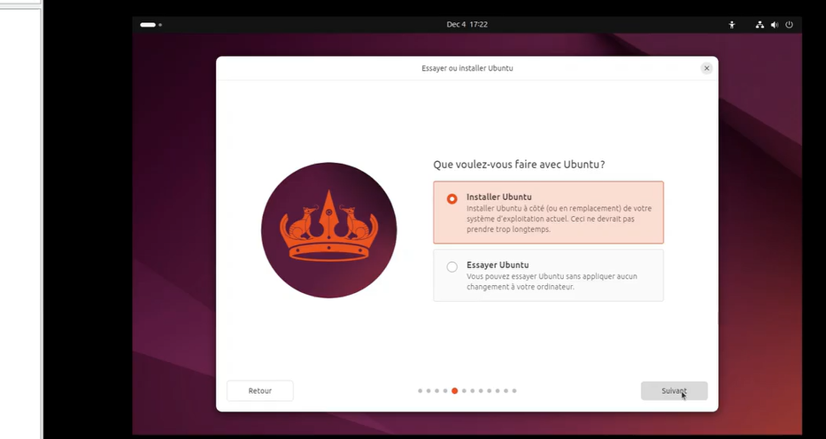

9. Sur l'écran "Type d'installation", laissez l'option **Installation interactive** cochée et cliquez sur **Suivant**.

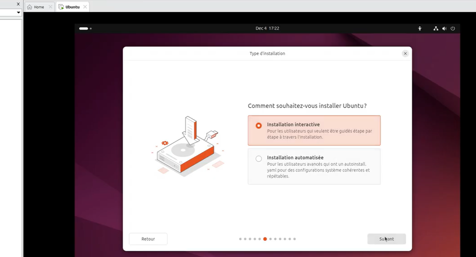

10. Sur l'écran "Applications et mises à jour", laissez l'option **Installation par défaut** cochée et cliquez sur **Suivant**.

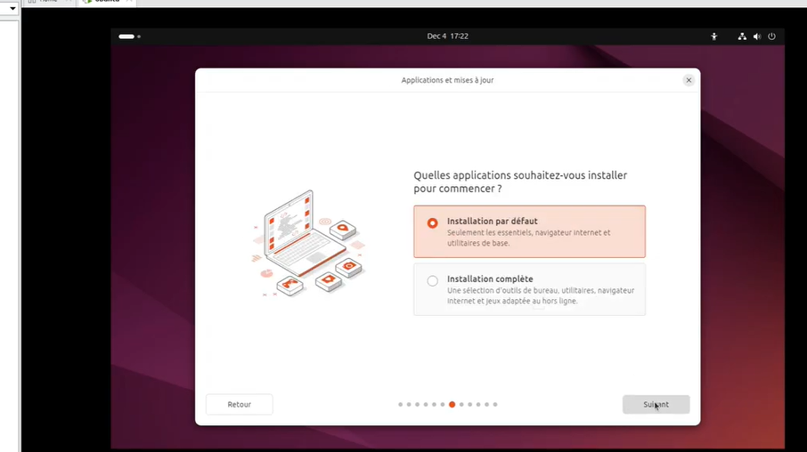

11. Sur l'écran "Optimisez votre ordinateur", ne cochez aucune case (laissez tout vide) et cliquez simplement sur **Suivant**.

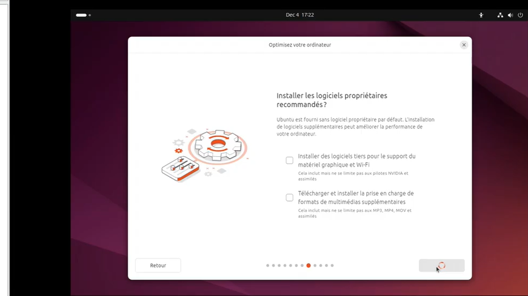

12. Sur l'écran "Configuration du disque", cochez la première option **"Effacer le disque et installer Ubuntu"** puis cliquez sur **Suivant**. *(Note : Cela n'efface que le disque virtuel de 40 Go que nous avons créé, vos données personnelles sur Windows sont en sécurité).*

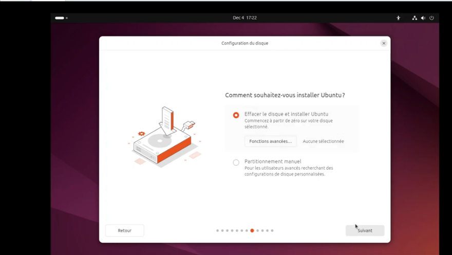

13. Sur l'écran "Créer votre compte", saisissez vos informations : votre nom, le nom de la machine virtuelle, votre nom d'utilisateur, et un mot de passe. Mémorisez bien ce mot de passe, il vous sera utile pour vous connecter ! Cliquez sur **Suivant**.

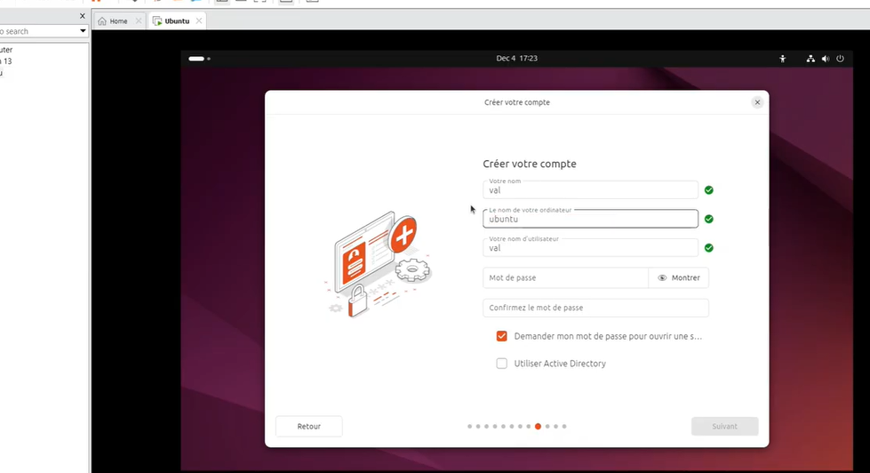

14. Sur l'écran "Sélectionnez votre fuseau horaire", choisissez votre emplacement (ex: Europe) en cliquant sur la carte ou en tapant dans la barre de recherche, puis cliquez sur **Suivant**.

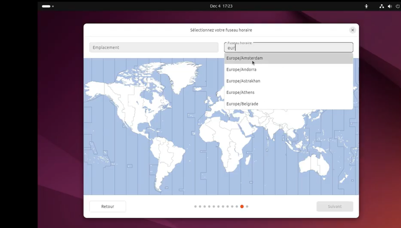

15. Un écran "Prêt à installer" s'affiche. Il récapitule toutes les configurations que vous venez de faire. Cliquez sur le bouton vert **Installer** pour valider et lancer le processus final.

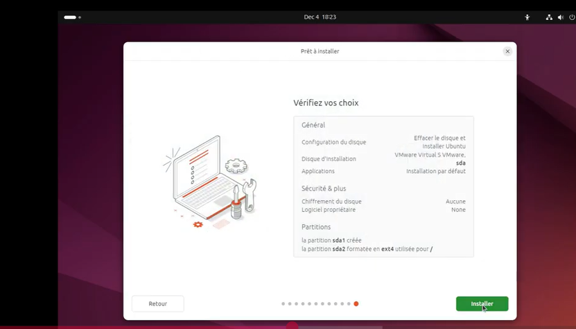

16. **Le processus d'installation démarre :**
L'interface "Rapide, libre, et plein de nouveautés" s'affiche avec une barre de progression en bas indiquant la "Copie des fichiers...". 
À partir de ce moment, l'assistant installe concrètement le système d'exploitation Ubuntu sur le disque dur virtuel de votre machine. Vous n'avez plus aucune action à faire, il vous suffit de patienter jusqu'à la fin du chargement. Une fois terminé, le système vous demandera de redémarrer la machine virtuelle pour commencer à l'utiliser.

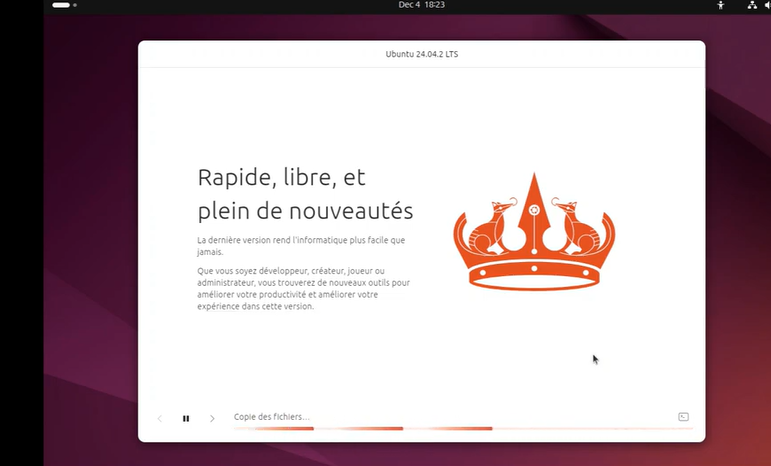

17. Une fois l'installation terminée, la fenêtre "Installation terminée" s'affiche avec la couronne orange. Cliquez sur le bouton vert **Redémarrer maintenant**.

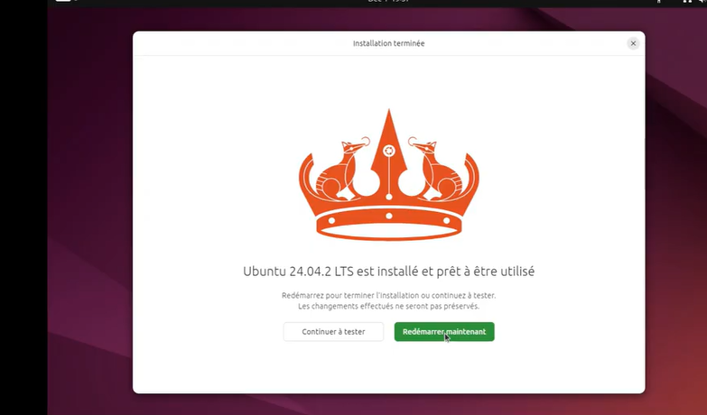

18. Après le redémarrage, la machine virtuelle lance Ubuntu. L'écran de connexion apparaît. Cliquez sur votre profil et **saisissez votre mot de passe** pour vous connecter.

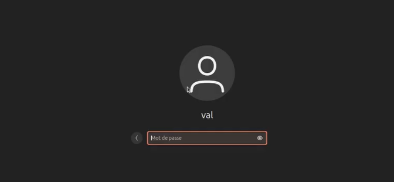

19. Félicitations, vous êtes connecté ! Voici l'**interface principale du bureau Ubuntu**.

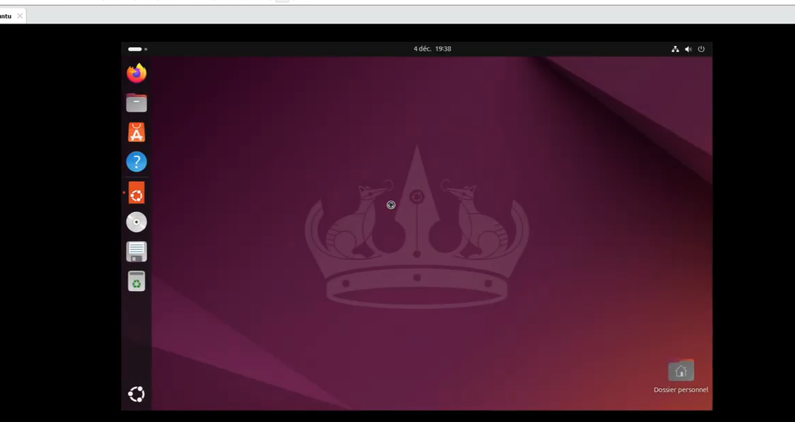

20. Une petite fenêtre "Bienvenue dans Ubuntu" va s'ouvrir pour une configuration rapide. Cliquez simplement sur **Suivant**.

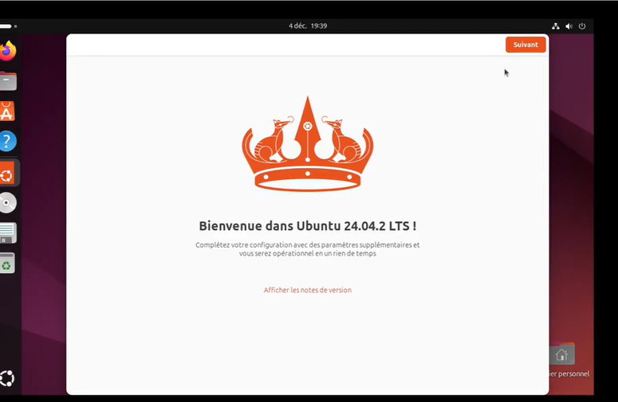

21. Sur l'écran "Activer Ubuntu Pro", choisissez la deuxième option : **"Passer pour le moment"** puis cliquez sur le bouton **Passer** (ou Suivant) en haut à droite.

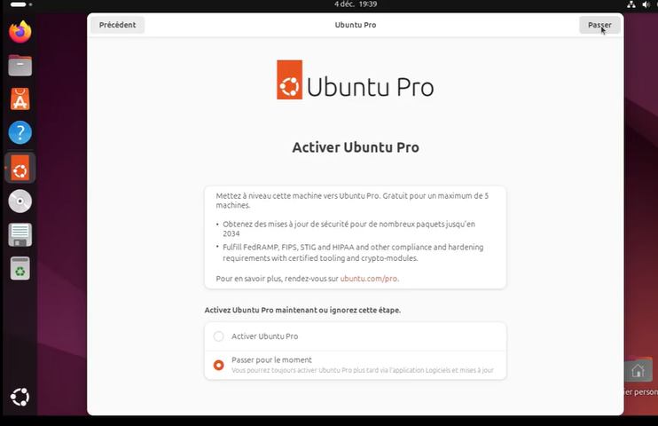

22. Sur l'écran "Aidez-nous à améliorer Ubuntu", cochez l'option **"Non, ne partagez pas les données du système"** puis cliquez sur **Suivant**.

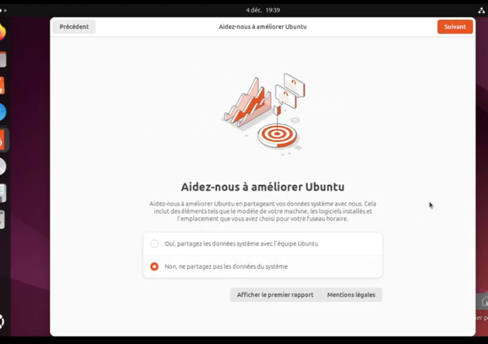

23. Enfin, sur l'écran "Prêt à partir", cliquez sur le bouton orange **Terminer** en haut à droite. 
Félicitations, votre installation est totalement terminée et votre système est 100% prêt à l'emploi !

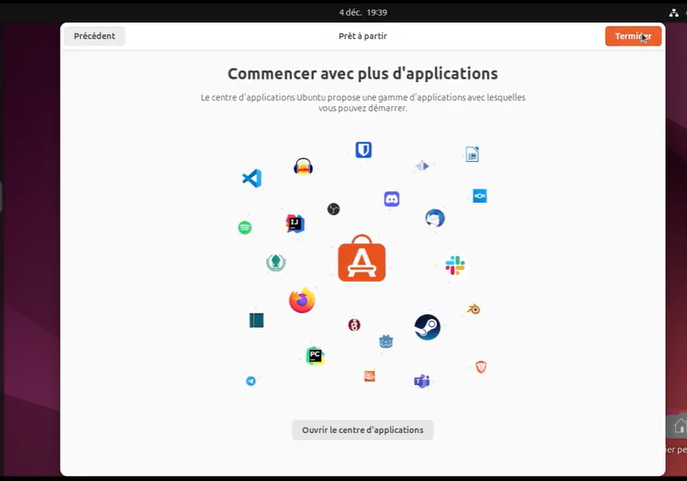
